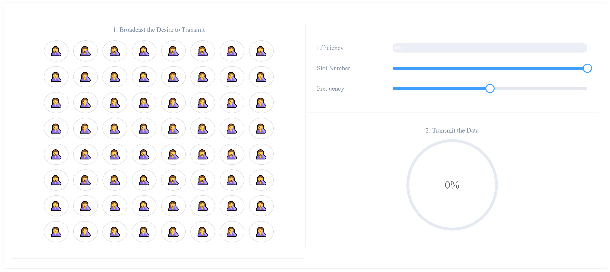
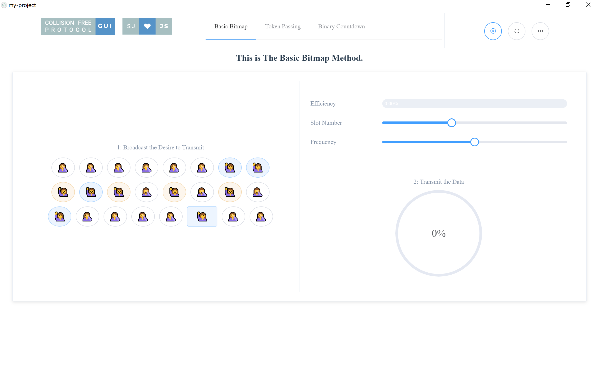
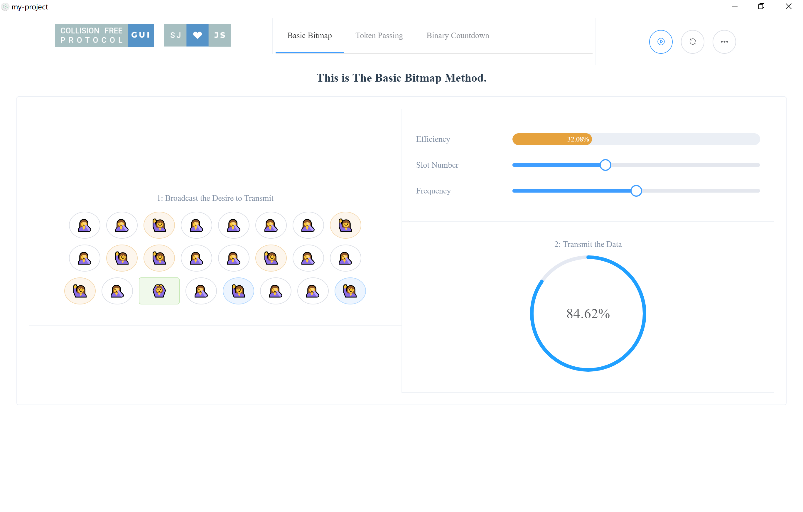

# 使用说明

`1751918 温鑫`

[toc]

本程序将计算机网络中的一种无冲突协议——位图协议进行了图形化的实现。

为了保证良好的使用效果，请全屏运行本程序。

以 `Windows` 用户为例，请双击 `collision-free-protocol-gui\build\collision-free-protocol-gui-win32-x64` 目录下的可执行文件 `collision-free-protocol-gui.exe` 以运行程序。

## 用户界面

用户界面如下：

 

自上而下，界面可以分为顶部栏、标题栏、界面主体三部分，下面分别进行介绍：

### 顶部栏

顶部栏自左向右分为LOGO、菜单、按键区三部分。中部的菜单可以选择进行位图协议、令牌传递协议（待开发）、二进制倒计数协议（待开发）三种无冲突协议的演示。右侧三个按键分别控制演示开始/结束、刷新、设置。

### 标题栏

标题栏标识了当前演示的是哪一个协议。

### 界面主体

界面主体是本程序的核心区域，进行动画演示，并提供控制接口、呈现关键信息。界面主体可分为三个部分，左侧对位图协议的每个二进制位进行了拟人化的抽象表示，每个圆形代表一个二进制位，圆形的状态则代表该二进制位的状态。右侧上半部分第一行展示了当前的传输效率，第二行可以调整二进制位数，第三行可以调整消息到达的频繁程度。右侧下半部分则展示了传输阶段的完成度。

### 图标的代表含义

我们对位图协议的每个二进制位进行了拟人化的抽象表示，每个圆形代表一个二进制位，圆形的状态则代表该二进制位的状态。每个状态的样式及其代表含义如下：

空闲态：

提出发送需求，待扫描：

提出发送需求，已扫描：

数据发送成功：

其中图标为圆形代表当前未被扫描，图标为方形代表是正接受扫描的二进制位。

## 演示方法

首先拖动滑杆，选择合适的二进制位数及数据发送频率，然后点击“开始”按键即可开始演示。

程序运行分为两个阶段，第一阶段**每个二进制位**被依次扫描，若其已提出发送需求，则被记录，对应位图协议的第一阶段。第二阶段**每个被记录二进制位**被依次扫描，进行数据发送，对应位图协议的第二阶段。期间，每个空闲二进制位都有一定概率提出数据发送需求，但只有被扫描且标记的二进制位会被发送，否则需要等待到下一个扫描-发送周期。下图演示了第一阶段的运行界面：

下图演示了第二阶段的运行界面：

