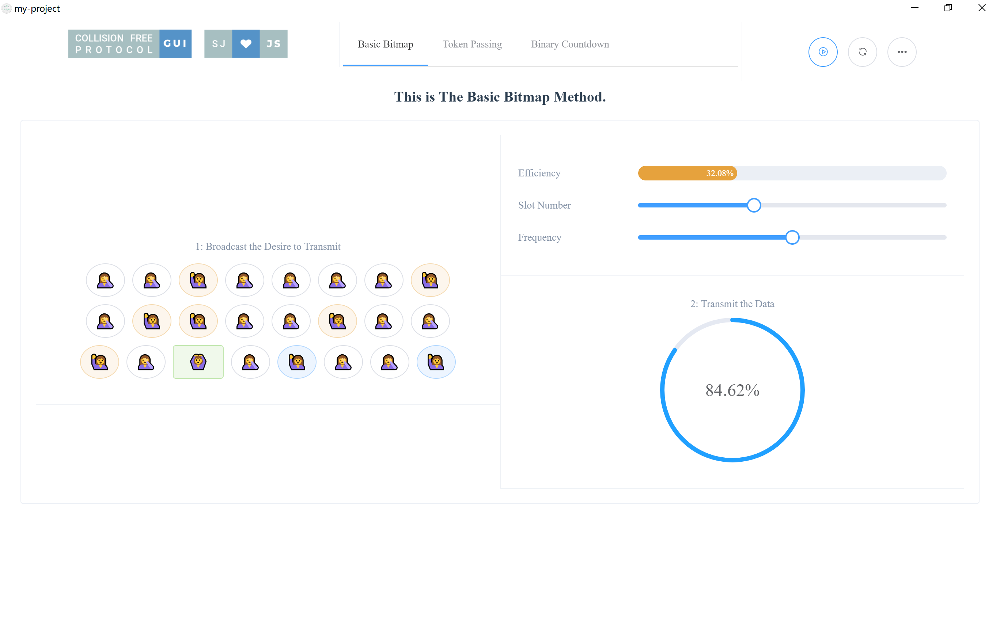

# 无冲突协议图形化演示-设计文档

`1751918 温鑫`

[toc]

## 总述

本次作业将计算机网络中的一种无冲突协议——位图协议进行了图形化的实现，基于Electron 进行跨平台部署，基于 Vue.js 与 Element UI 实现前端框架，最终实现了一款跨平台（Windows/MAC/Linux）应用程序。

## 位图协议简介

尽管在CSMA ／CD 中，站点抓住了信道后，便不会产生冲突，但在竞争周期冲突仍不可避免。这将降低系统的件能，尤其是当电缆很长（$T$ 很大）而帧很短时。当很长的宽带光纤网投入使用时，较大的 $T$ 和短帧所产生的问题就更加突出了。下面介绍的是一种无冲突协议——位图协议。

位图协议采用了基本的位图方法（basic bit-map method ）。在该协议中，它的竞争周期恰好由 $N$ 个时隙组成。如果站点 $0$ 想发送一帧，它就在第 $0$ 个时隙内发送1比特，该时隙内，不允许其他任何站点发送，无论站点 $0$ 干了什么，只要站点1有一帧在排队等待发送，它就可以在时隙 $1$ 内发送 $1$ 比特。一般地，某一站点可以通过在某一时隙内填入一个比特来声明它有一帧想要发送。当 $N$ 个时隙过去，每个站点也就知道了究竞有哪些站点想要发送，然后它们就按照数字顺序依次发送，如下图所示：


因为每一个站点都知道下一个该谁发送，所以根本就不可能发生冲突，当最后一个待发送的站点成功发送后，每个站点都可容易地检测到这个事件， 新的一轮N 比特竞争周期又将开始。如果某个站点在其时隙过后才作好发送准备，那算它不走运，它必须保持沉默，直到每个站点都完成发送，新的一轮位图再次开始。像这种在实际发送之前首先声明的协议被称为预订协议（Reservation Protocol）。

下面简单地分析一下这个协议的性能。为了方便起见，以竞争位隙作为时间的基准单位，假设每个数据帧由 $d$ 个时间单位组成。在低载荷的情况下，由于没有数据帧等待发送，因此，只有位图一遍遍地重复。

首先考虑一下小序号站的情况，比如站 $0$ 或站 $1$ 。典型地，当它准备好发送时，当前的时隙会处于位图的中部某处。平均地，每个站必须等待 $N/2$ 时隙的本次扫描完成， 以及新的一轮外个位隙扫描完毕后，才能发送。

大序号站的情况就好多了。通常情况下，它们只需等待下次扫描小序号站平均等待时间为 $1.5N$ 个位隙，大序号平均等待时间为 $0.5$ 个位隙，因此，所有站平均等待时间为 $N$ 个位隙。 于是低载荷情况下的效率很容易计算出来，每帧的额外开销是 $N$ 比特，数据量为 $d$ 比特，效率为 $d/(N+d)$。

在高载荷情况下，假如所有站点总是有东西要发送，那么 $N$ 比特竞争时间按比例分配给 $N$ 帧数据，相当于每帧产生了一比特额外开销，因此，效率为 $d ／(d+1)$，一帧的平均时延等于在站内排队时间，加上该帧排队列队列头所需的另外 $N (d+1)／2$ 比特传输时间。

## 技术选型

### Electron 简介

Electron是由Github开发，用HTML，CSS和JavaScript来构建跨平台桌面应用程序的一个开源库。 Electron通过将Chromium和Node.js合并到同一个运行时环境中，并将其打包为Mac，Windows和Linux系统下的应用来实现这一目的。

Electron于2013年作为构建Github上可编程的文本编辑器Atom的框架而被开发出来。这两个项目在2014春季开源。

目前它已成为开源开发者、初创企业和老牌公司常用的开发工具。

关于 Electron 的详细文档，请参见 https://electronjs.org/。

### Vue.js 简介

Vue (读音 /vjuː/，类似于 **view**) 是一套用于构建用户界面的**渐进式框架**。与其它大型框架不同的是，Vue 被设计为可以自底向上逐层应用。Vue 的核心库只关注视图层，不仅易于上手，还便于与第三方库或既有项目整合。另一方面，当与现代化的工具链及各种支持类库结合使用时，Vue 也完全能够为复杂的单页应用提供驱动。

关于 Vue.js 的详细文档，请参见 https://vuejs.org/。

### Element UI 简介

Element，一套为开发者、设计师和产品经理准备的基于 Vue 2.0 的桌面端组件库。

关于 Element-UI 的详细文档，请参见 https://element.eleme.cn/。

## 详细设计

### 目录结构

本项目借助 [electron-vue](https://github.com/SimulatedGREG/electron-vue) 使用 [vue-cli](https://github.com/vuejs/vue-cli) 生成，目录结构如下图所示：


其中源码部分在 `src/` 目录下，分为 `main` 进程和 `renderer` 进程两部分。由于编写图形化界面不需要复杂的系统调用，所有工作均在 `renderer` 目录下进行，`components` 目录下存放了各 `vue` 模块的源码。如果想直接运行编译后的程序，请直接在 `build` 目录下根据系统选择合适的可执行程序运行。若希望从源码构建，请参照下节。

### 构建方法

``` bash
# install dependencies
npm install

# serve with hot reload at localhost:9080
npm run dev

# build electron application for production
npm run build

# run unit & end-to-end tests
npm test

# lint all JS/Vue component files in `src/`
npm run lint

```

### 使用说明

为了保证良好的使用效果，请全屏运行本程序。

以 `Windows` 用户为例，请双击 `collision-free-protocol-gui\build\collision-free-protocol-gui-win32-x64` 目录下的可执行文件 `collision-free-protocol-gui.exe` 以运行程序。

#### 用户界面

用户界面如下：

 

自上而下，界面可以分为顶部栏、标题栏、界面主体三部分，下面分别进行介绍：

##### 顶部栏

顶部栏自左向右分为LOGO、菜单、按键区三部分。中部的菜单可以选择进行位图协议、令牌传递协议（待开发）、二进制倒计数协议（待开发）三种无冲突协议的演示。右侧三个按键分别控制演示开始/结束、刷新、设置。


##### 标题栏

标题栏标识了当前演示的是哪一个协议。


##### 界面主体

界面主体是本程序的核心区域，进行动画演示，并提供控制接口、呈现关键信息。界面主体可分为三个部分，左侧对位图协议的每个二进制位进行了拟人化的抽象表示，每个圆形代表一个二进制位，圆形的状态则代表该二进制位的状态。右侧上半部分第一行展示了当前的传输效率，第二行可以调整二进制位数，第三行可以调整消息到达的频繁程度。右侧下半部分则展示了传输阶段的完成度。


##### 图标的代表含义

我们对位图协议的每个二进制位进行了拟人化的抽象表示，每个圆形代表一个二进制位，圆形的状态则代表该二进制位的状态。每个状态的样式及其代表含义如下：

空闲态：


提出发送需求，待扫描：


提出发送需求，已扫描：


数据发送成功：


其中图标为圆形代表当前未被扫描，图标为方形代表是正接受扫描的二进制位。

#### 演示方法

首先拖动滑杆，选择合适的二进制位数及数据发送频率，然后点击“开始”按键即可开始演示。

程序运行分为两个阶段，第一阶段**每个二进制位**被依次扫描，若其已提出发送需求，则被记录，对应位图协议的第一阶段。第二阶段**每个被记录二进制位**被依次扫描，进行数据发送，对应位图协议的第二阶段。期间，每个空闲二进制位都有一定概率提出数据发送需求，但只有被扫描且标记的二进制位会被发送，否则需要等待到下一个扫描-发送周期。下图演示了第一阶段的运行界面：


下图演示了第二阶段的运行界面：

